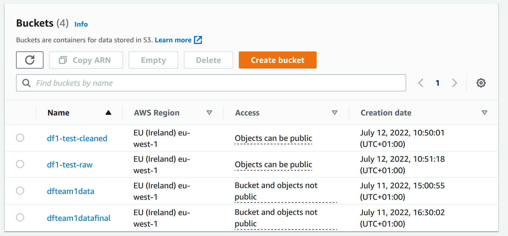
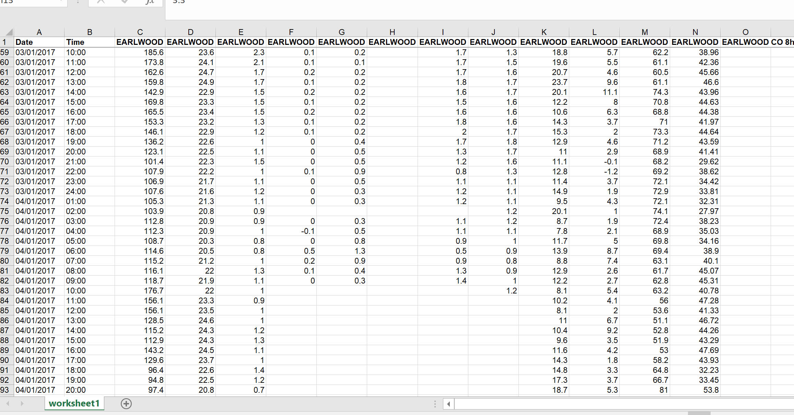
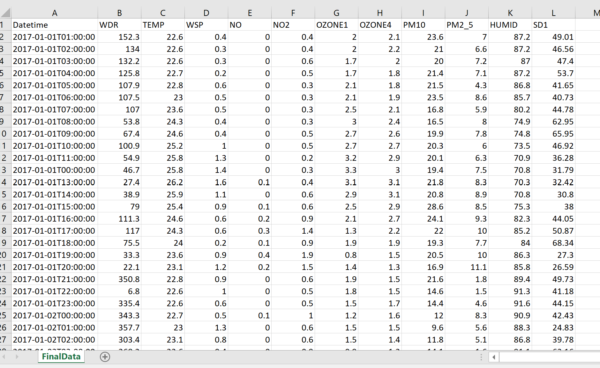
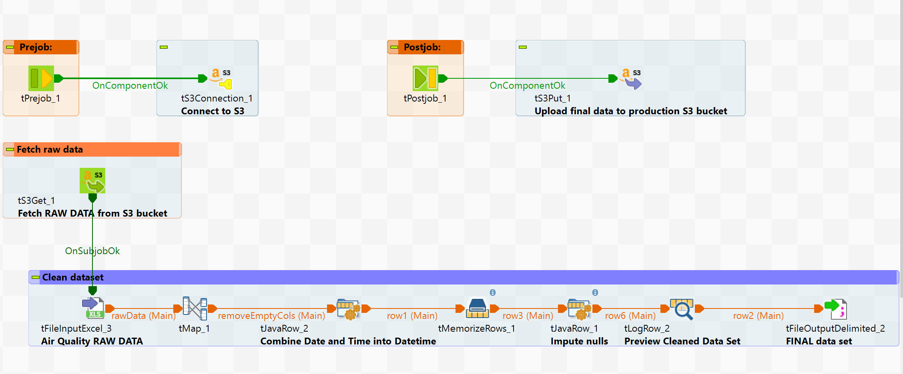
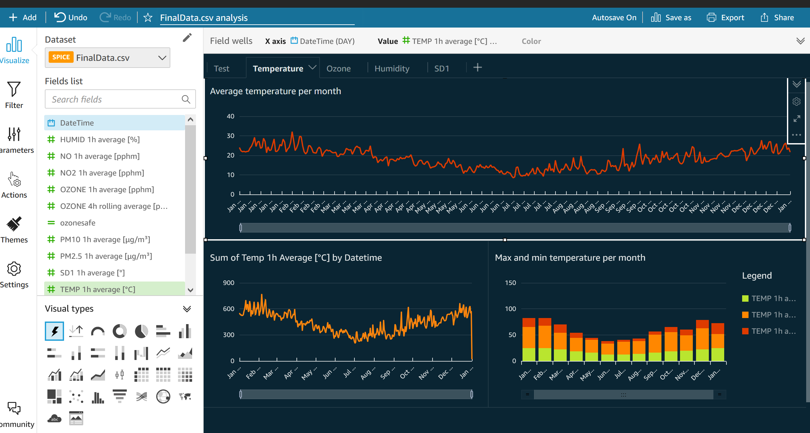

# The Plan

## What do you think your goal is?

A data analyst must:

- Understand pollution
- Finding causes of pollution

## We aim to help them by:

- Making a dashboard that enables data analysts to gain the above insights

## Understanding of the points above What are the major steps?

- Understand the data
- Upload to an S3 bucket
- Upload to Talend from the S3 bucket
- Clean the data – use Talend
- Upload it to Amazon via Talend
- Learn about QuickSight
- Create a dashboard on Quicksight

## List the pitfalls

- Quicksight might not work on a student account
- Cleaning data may have roadblocks
- Talend licencing issues

## What's in scope for version one

- On version 1 we can build the system without cleaning data
- All data fields displayed

## What questions need to be considered

- The question will always be a when (the data is with time parameters)
- Rate of change

## What is the tech-stack, draw out diagram of data flow

- Amazon S3
- Amazon Redshift (Amazon RDS as backup)
- Amazon Quicksight (Tableau as a backup)
- Talend (KNIME as a backup)

## Timeline:

| day   | activities                             |
| ----- | -------------------------------------- |
| Mon   | Planning                               |
|       | AWS account stup today                 |
|       | Understand dataset                     |
|       | Trello board                           |
|       | Quicksight research                    |
| Tues  | Talend work                            |
| Wed   | Setup Redshift and QuickSight          |
|       | Fill in null values using Talend       |
|       | Build dashboard version 1              |
| Thurs | Iterate to a version 2 (data cleaning) |
|       | Practise run of presentation           |
| Fri   | Presentation                          |

# What we did

We setup two S3 buckets, one for the raw data and the other for the cleaned data. Then we ran a Talend ETL job between the two S3 buckets. Finally, QuickSight was connected to the S3 bucket containing the cleaned data. Data analysts can then use QuickSight to visualise the data for data-driven insights.

S3 -> Talend -> S3 -> QuickSight

Step-by-step procedure

1. Upload raw data file to S3 bucket (staging bucket)
2. Fetch the raw data file in Talend
3. Process the data in Talend
   1. Remove empty columns
   2. Apply data unification
   3. Combine Date and Time columns into a single Datetime column
   4. Impute null values using values in previous rows
4. Upload cleaned data to a separate S3 bucket (production data)
5. Use QuickSight to build visual dashboards from data in S3

#### On why we did not use Redshift

We didn't end up using Redshift as it seemed that the tools provided by QuickSight sufficed to slice and dice our data for creating visual dashboards.

Giving data analysts the ability to run their custom SQL queries on our data set didn't add much value on top of what QuickSight could provide. From our point of view, the costs of setting up Redshift outweighed the benefits. There is a lengthy set up process for Redshift and the key data-driven insights obtainable from being able to run SQL queries on the data, which is the reason for using Redshift, were already obtainable through QuickSight. 

If requested by data analysts during the sprint review, we could consider setting up Redshift to allow for SQL access to the data in the next iteration.

### 1. Setting up AWS and creating S3 buckets

#### S3 buckets

### 2. Cleaning the data
#### Visual comparison of data before and after cleaning

Raw data

Cleaned data

#### Steps taken

1. Removing empty columns

We used the tMap component to only select non-empty columns

2. Data unification

We needed to ensure that all rows in the same column had the same format and length. 

To do this, we made use of the metadata schemas in talend to fix the precision of floating-point values.

3. Date and time columns

The date and time columns from the raw data contained strings. But we needed them to be dates in order to group our data for data visualisation purposes.

Moreover, the time column was missing minutes.

We used a tJavaRow component to combine the date and time columns into a single datetime column and converted the type from string to date.

Then we specified how to format the datetime using the schema in Talend.

(See [Cleaning data headers](./Data_Header_Key.md) for more details.)

4. Imputing null and missing values

We considered using PySpark, Pandas as alternatives to Talend, but stuck with Talend.

The initial plan was to use data interpolation to fill in a missing value using the average of the value in the previous and subsequent rows.

The problem we faced in Talend was not being able to access subsequent rows when reading the data row by row. This meant that we couldn't calculate averages in the way we wanted.

We tried to use SQL in Talend to do this, but also to no avail.

We ended up filling in empty values by copying in the value in the previous row. 

(See [Inputing null values](./Imputing%20null%20values.md) for more details.)

#### Talend job

### 3. Using QuickSight to build visual dashboards

#### Connecting to data in S3

Load data from S3 into SPICE using a manifest.json file.

Create a manifest.json file in the S3 bucket containing the cleaned data set.

[manifest.json formatting guide](https://docs.aws.amazon.com/quicksight/latest/user/supported-manifest-file-format.html)

Select "New analysis"
Select "New dataset"
Select "S3"
This should open up a modal asking for a name and manifest.json file.

Name the data source and include the URL to the manifest.json

`https://dfteam1datafinal.s3.eu-west-1.amazonaws.com/manafest.json`

Connect to data set.

